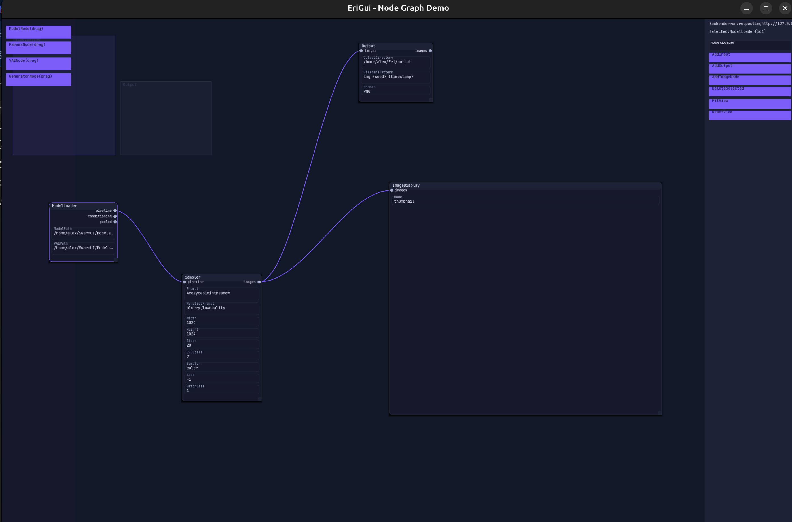

# EriGui - Pure Rust GUI Framework

**Version: Alpha 0.0.3**

**Status: Work in Progress** - This framework is functional but detailed testing has not been completed. Use with caution in your projects.

EriGui is a comprehensive, pure Rust GUI framework designed for Wayland-only environments with OpenGL rendering. It provides a rich set of 30+ widgets and modern features while maintaining a simple, type-safe API.

## Features

- 🦀 **Pure Rust** - No C/C++ dependencies, no X11
- 🖼️ **Wayland Native** - Built specifically for Wayland
- 🎨 **OpenGL Rendering** - Hardware-accelerated with integer coordinates
- 🧩 **Rich Widget Set** - 30+ widgets including advanced components
- ♿ **Accessibility** - Built-in screen reader support
- 🎯 **Type Safe** - Leverage Rust's type system
- 🎭 **Themeable** - Dark/light themes with customization
- 📱 **Responsive** - Flexible layout system
- 🖱️ **Drag & Drop** - Built-in drag and drop support
- ⌨️ **Keyboard Navigation** - Full keyboard accessibility
- 🔔 **Notifications** - Toast notification system
- 🗂️ **Docking** - Advanced panel docking system

## Architecture

The framework is organized into four crates:

- `erigui-core` - Core types, traits, and abstractions
- `erigui-rendering` - OpenGL rendering backend
- `erigui-widgets` - Widget implementations
- `erigui-examples` - Example applications

## Getting Started

### Prerequisites

- Rust 1.70 or later
- OpenGL 2.1+ compatible graphics driver
- System dependencies:
  ```bash
  # Ubuntu/Debian (Wayland-only, no X11)
  sudo apt-get install libwayland-dev libegl1-mesa-dev libgl1-mesa-dev build-essential
  
  # macOS
  # No X11 required - uses native window system
  ```

### Building

```bash
cd rust-gui
cargo build --release
```

### Running Examples

```bash
# Basic demos
cargo run --example hello_world          # Basic rendering
cargo run --example button_demo          # Button variations
cargo run --example text_input_demo      # Text input features

# Widget showcases
cargo run --example tree_view_demo       # Tree widget with file browser
cargo run --example color_picker_demo    # Color selection
cargo run --example notification_demo    # Toast notifications
cargo run --example dock_panel_demo      # Docking system

# Advanced features
cargo run --example enhanced_widgets_demo # Drag & drop, keyboard nav, accessibility
cargo run --example file_manager         # Complete file manager application
```

## Quick Start

```rust
use erigui_core::*;
use erigui_widgets::*;
use erigui_rendering::Renderer;
use winit::event_loop::EventLoop;

fn main() {
    let event_loop = EventLoop::new();
    let mut renderer = Renderer::new(&event_loop, 800, 600, "My App")
        .expect("Failed to create renderer");
    
    let theme = Theme::dark();
    
    // Create widgets
    let button = Button::new(WidgetId::default(), "Click Me!")
        .with_on_click(|| println!("Button clicked!"));
    
    let mut text_input = TextInput::new(WidgetId::default())
        .with_placeholder("Type something...");
    
    // Main loop - see examples for complete implementation
    event_loop.run(move |event, _, control_flow| {
        // Handle events, layout, and drawing
    });
}
```

## Widget Catalog

### Basic Input
- **Button** - Clickable buttons with icon support
- **TextInput** - Single-line text input
- **TextArea** - Multi-line text editor with undo/redo
- **CheckBox** - Toggle boxes
- **RadioButton** - Mutually exclusive options
- **Slider** - Numeric value selection
- **SpinBox** - Numeric input with arrows
- **ColorPicker** - Advanced color selection

### Containers
- **Container** - Basic layout container
- **ScrollView** - Scrollable content area
- **TabControl** - Tabbed interface
- **Accordion** - Collapsible panels
- **DockPanel** - IDE-style docking system

### Data Display
- **Label** - Text display
- **ListView** - Scrollable item list
- **TreeView** - Hierarchical tree structure
- **ProgressBar** - Progress indication
- **StatusBar** - Status information

### Navigation
- **Menu** & **MenuBar** - Application menus
- **ContextMenu** - Right-click menus
- **Toolbar** - Tool buttons with overflow
- **Breadcrumb** - Navigation path

### Dialogs & Feedback
- **Dialog** - Modal and non-modal dialogs
- **FileDialog** - File browser dialog
- **Notification** - Toast notifications
- **Tooltip** - Context-sensitive help

### Advanced
- **SearchBox** - Search with suggestions
- **DateTimePicker** - Date and time selection
- **FileManager** - Dual-pane file browser
- **Node Widgets** - Building blocks for node-based applications

## Node Widgets

EriGui provides node widgets as building blocks for creating node-based applications:



**Available Node Widgets:**
- **NodeWidget** - Draggable node with title, ports, and content area
- **NodePort** - Input/output connection points with type hints
- **NodeConnection** - Bezier curve connections between ports
- **NodeCanvas** - Container for nodes with pan/zoom support

**Build Your Own Node App:**
- Compose node widgets to create visual programming interfaces
- Shader editors, audio routing, workflow automation, etc.
- Full control over node types, port definitions, and behavior
- Widgets handle rendering and interaction, you define the logic

```bash
cargo run --example node_graph_demo
```

## Documentation

- 📖 **[Widget Guide](WIDGET_GUIDE.md)** - Comprehensive widget documentation with examples
- 🚀 **[Quick Reference](QUICK_REFERENCE.md)** - Common patterns and code snippets  
- 🔄 **[Migration Guide](MIGRATION_GUIDE.md)** - Coming from GTK, Qt, or other frameworks
- 📝 **API Documentation** - Run `cargo doc --open` for full API docs

## Design Principles

1. **Pure Rust** - No FFI or C dependencies
2. **Type Safety** - Leverage Rust's type system  
3. **Integer Coordinates** - All positions use `i32` for pixel-perfect rendering
4. **Retained Mode** - Widgets persist between frames
5. **Accessibility First** - Built-in screen reader support
6. **Theme System** - Consistent styling across all widgets

## Advanced Features

### Drag & Drop
```rust
let manager = drag_drop_manager();
manager.register_drop_target(widget_id, vec!["text/plain".to_string()]);
manager.start_drag(source_id, "text/plain", Box::new(data), offset);
```

### Keyboard Navigation  
```rust
let nav = keyboard_nav_manager();
nav.register_widget(FocusableWidget {
    id: widget.id(),
    tab_index: Some(1),
    focusable: true,
    ..Default::default()
});
```

### Accessibility
```rust
let a11y = accessibility_manager();
a11y.register_node(AccessibilityNode {
    role: AccessibilityRole::Button,
    label: "Save Document".to_string(),
    ..Default::default()
});
```

## Contributing

Contributions are welcome! Please:

1. Fork the repository
2. Create a feature branch
3. Write tests for new features
4. Ensure all tests pass
5. Submit a pull request

## Performance Tips

1. **Batch Updates** - Update multiple properties before calling redraw
2. **Lazy Layout** - Only recalculate layout when bounds change
3. **Event Filtering** - Return `EventResult::Ignored` for unhandled events
4. **Widget Reuse** - Update existing widgets instead of recreating
5. **Selective Rendering** - Use clipping for large widget trees

## License

MIT OR Apache-2.0

## Acknowledgments

Built with ❤️ in Rust for the modern Linux desktop!

## Version History

- **v0.0.3-alpha** - Current release
  - 30+ widgets implemented including node widgets for building node-based apps
  - Production quality improvements:
    - DockPanel: Safe path-based navigation (removed raw pointers)
    - DateTimePicker: Safe date validation (removed unwrap panics)
    - TextInput: UTF-8 cursor boundary validation
    - FileDialog: Path traversal security validation
    - ContextMenu: Bounded positioning (stays within window)
    - FileManager: System file opening for images and other files
  - Comprehensive test suite (71 tests)
  - Safety comments for all unsafe OpenGL blocks
  - API subject to change